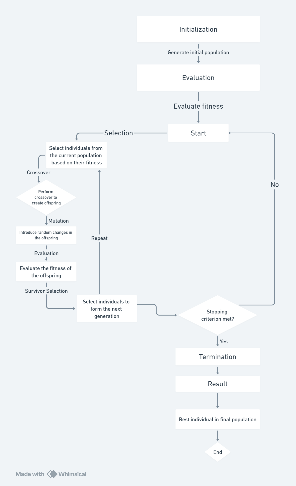

# Paper Summary: Genetic Algorithm for Shortest Vector Problem

This repository contains the implementation and experimental results of a genetic algorithm designed to solve the Shortest Vector Problem (SVP) in lattices. The paper explores the application of genetic algorithms, local search, and heuristic pruning techniques to efficiently find the shortest non-zero vector in a lattice.

## Solution Flow



## Class Diagram


## Getting Started

To get started with the project, follow these steps:

1. **Clone the Repository**: Begin by cloning this repository to your local machine using the following command:

   ```bash
   git clone https://github.com/rohan-kalra904/GeneticAlgorithmsForSVP.git


### Prerequisites


To understand and work with the concepts presented in the paper on the Genetic Algorithm for the Shortest Vector Problem, it is recommended to have a basic understanding of the following:

- **Lattice Theory**: Familiarity with the fundamentals of lattices, lattice basis reduction, and lattice problems such as the Shortest Vector Problem (SVP) and Closest Vector Problem (CVP).

- **Genetic Algorithms**: Knowledge of genetic algorithm principles, including population-based optimization, selection mechanisms, crossover, and mutation operators.

- **Markov Chains**: Understanding of Markov chains and their application in modeling stochastic processes, particularly in the context of genetic algorithms.

- **Mathematical Optimization**: Basic knowledge of optimization techniques, search algorithms, and convergence analysis in the context of combinatorial optimization problems.


### Installing

A step by step series of examples that tell you how to get a development
environment running

Use this link for installing fplll

-[fplll](https://github.com/fplll/fplll)
-[fpylll](https://github.com/fplll/fpylll)

Use this for accessing datasets

-[DATASET](https://www.latticechallenge.org/svp-challenge/)

End with an example of getting some data out of the system or using it
for a little demo

### Command to run the code
To compile multiple object files, you can follow the instructions in [this link](https://ornl-training.github.io/cpp-compiler-intro/03-object-files/):


     g++ -o output_file *.cpp -lfplll -lmpfr -lgmp


replace the MainCode.cpp and output_file as needed, the intention is to show how to use flags

### Sample Tests

The challenge, which is the source of the paper referenced, can be found at : https://www.latticechallenge.org/svp-challenge .


## Acknowledgments

  - A Genetic Algorithm for Searching Shortest Lattice Vector of SVP Challenge, research paper.
